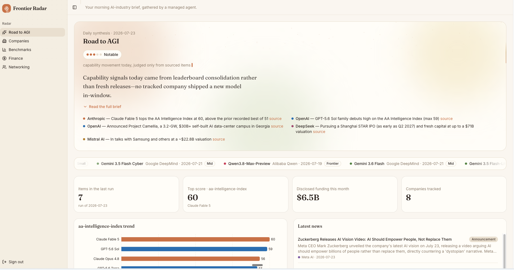
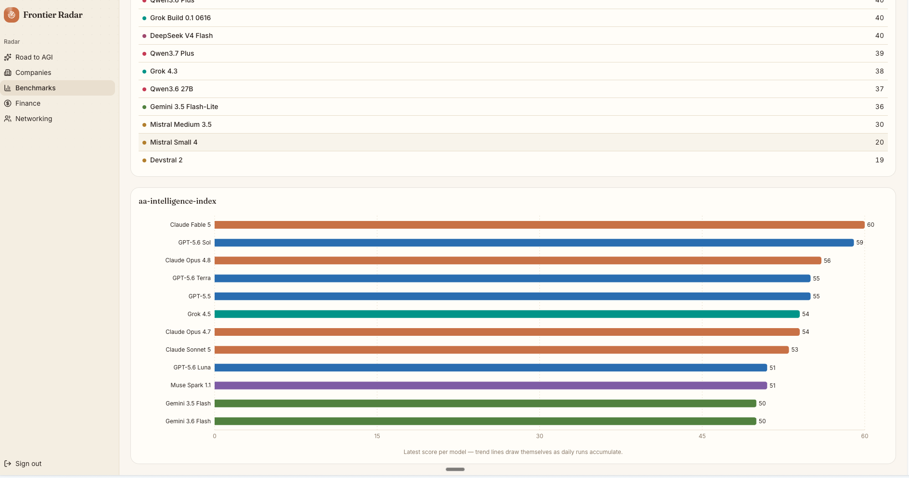
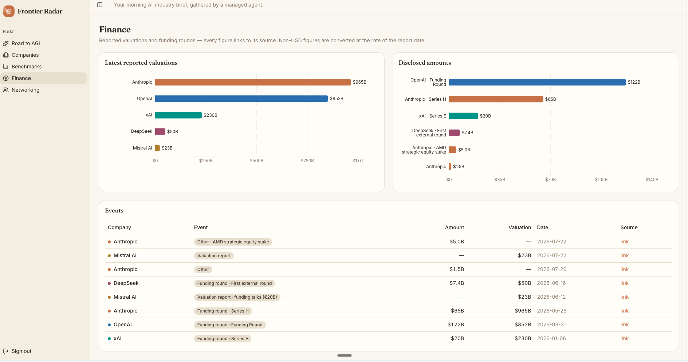
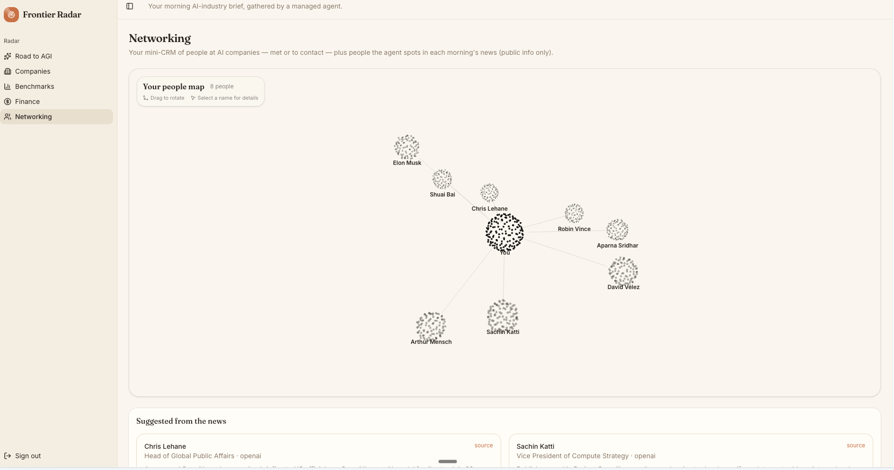

# Frontier Radar

**A source-linked daily intelligence system for the frontier AI market.**

Frontier Radar turns fragmented AI news, model releases, benchmarks, funding events,
company moves, and notable people into one focused morning brief.

Built during the **Claude Founder House** event and improved afterward into a broader
decision dashboard with historical benchmarks, finance tracking, and an interactive
3D people map.

## The product

### 1. Start with the daily signal

The Road to AGI view distills the latest run into a sourced synthesis, capability
movement, key events, market metrics, and the stories that matter.



### 2. Compare frontier models

Benchmark views turn daily observations into ranked model comparisons and become
historical trend lines as runs accumulate.



### 3. Follow capital and valuations

Finance connects reported valuations, disclosed amounts, and funding events to their
original sources.



### 4. Build the people graph

Networking maps contacts and people surfaced by the agent into an interactive 3D
network, while retaining a practical mini-CRM underneath.



Company pages complete the picture with a dedicated history of releases, news,
benchmarks, and financial events for every tracked lab.

## One fully managed intelligence pipeline

**All research, collection, synthesis, and delivery is handled by a scheduled Claude
Managed Agents deployment.** The intelligence pipeline requires no manual browsing or
dashboard data assembly.

```text
Scheduled managed-agent run
        │
        ▼
Coordinator delegates parallel research
        ├── News, releases, and notable people
        ├── Benchmark sources and model scores
        ├── Funding, valuations, and strategic finance
        └── Community and market signals
        │
        ▼
Source verification → normalization → deduplication
        │
        ▼
Daily synthesis + one validated schema-v1 JSON payload
        │
        ▼
Authenticated /api/ingest → Supabase → Frontier Radar
```

The coordinator owns the complete run: it activates specialists in isolated contexts,
merges their evidence, checks prior memory, resolves duplicates, writes the morning
synthesis, and submits one authenticated payload. The application then validates the
contract, performs idempotent upserts, and renders the updated dashboard. Source links
remain attached to the underlying intelligence.

## Essential stack

Next.js 16 · TypeScript · Tailwind CSS · Three.js · Recharts · Supabase · Vercel ·
Claude Managed Agents

## Run locally

```bash
npm ci
npm run dev
```

Without Supabase environment variables, the app runs in fixture-backed demo mode. The
full managed pipeline uses `NEXT_PUBLIC_SUPABASE_URL`,
`NEXT_PUBLIC_SUPABASE_ANON_KEY`, `SUPABASE_SERVICE_ROLE_KEY`, and `INGEST_TOKEN`.
